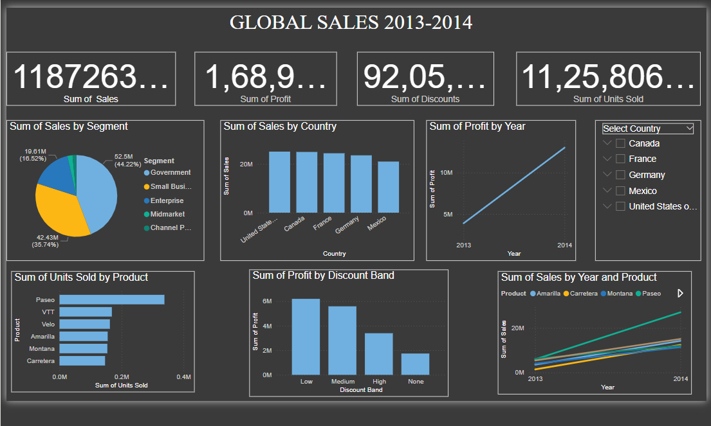

# Global Sales Overview Dashboard (Power BI)

This project showcases a ** Power BI dashboard** analyzing global sales, profit, discounts, and unit sold between 2013–2014 using a publicly available dataset from Kaggle.

## 📌 Dashboard Features:
- KPI cards for Sales, Profit, Discounts, and Units Sold
- Interactive slicers for country-level drilldown
- Visual breakdowns by:
  - Product
  - Segment
  - Country
  - Year
  - Discount Band
- Clean dark theme layout with interactive filtering

## 📂 Dataset
-Download the dataset used in this dashboard here: [Sample data.xlsx](dashboard/first_dashboard)
- Cleaned and used in `.pbix` for visualization

## 💡 Skills Demonstrated
- Power BI Visualization & DAX
- Data Modeling
- Slicer Filtering
- Dashboard Design 
- KPI Cards & Trend Charts

## 📷 Screenshot

---

## 👩‍💻 How to View
- Download the `Global_sales_dashboard.pbix` file and open it using Power BI Desktop.

---

## 🔗 Connect
Feel free to connect on [LinkedIn](https://www.linkedin.com/in/priya-shaji-426001280/)!

